# “我的世界”的安装和基本使用

## 1. jdk安装

### 1.2 安装包下载

Windows 32位系统下载：[点击下载jdk](http://123.56.223.163/jdk-8u152-windows-i586.exe)

Windows 64位系统下载：[点击下载jdk](http://123.56.223.163/jdk-8u152-windows-x64.exe)

### 1.3 安装步骤

1. 双击应用程序, 之后一直点“下一步”就可以了

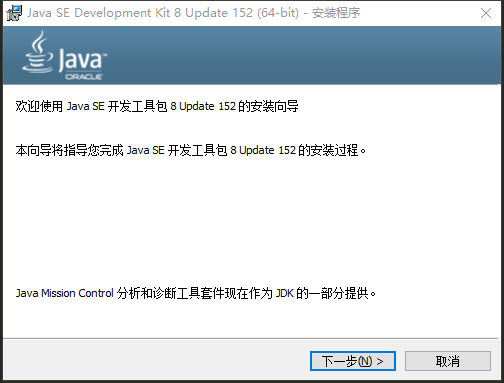

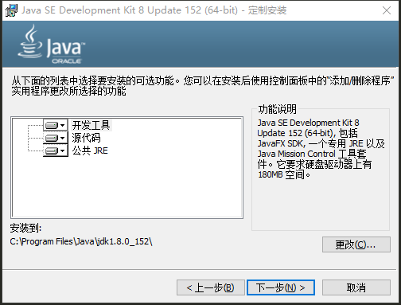

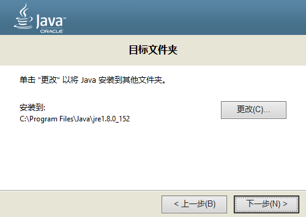

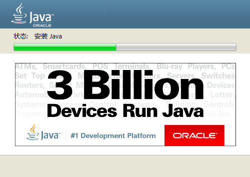

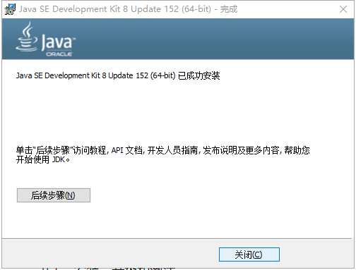

## 2. “我的世界”安装

### 2.1 游戏程序下载

[点击下载](http://123.56.223.163/Minecraft1.12.2_jdzh.zip)

### 2.2 解压

+ 把压缩文件放到你想放的地方（任意位置都行）

+ 鼠标选中压缩文件，右键选择“解压到当前文件夹”

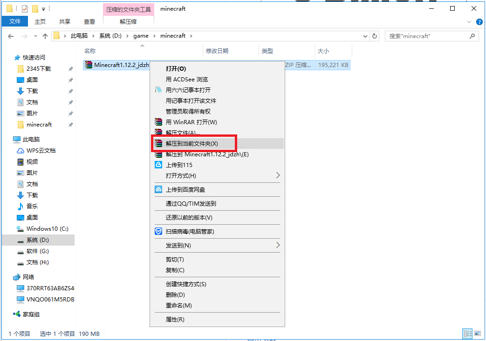

### 2.3 启动配置

+ 双击“点击启动”

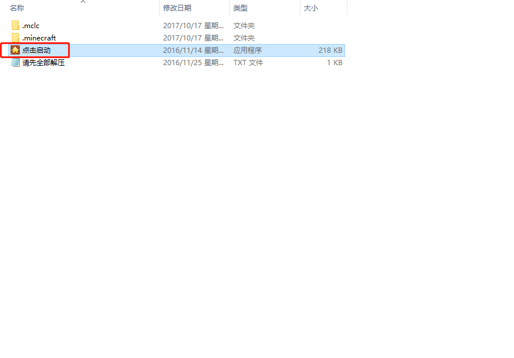

+ 版本选择1.12.2
+ 名字自己取(字母数字)

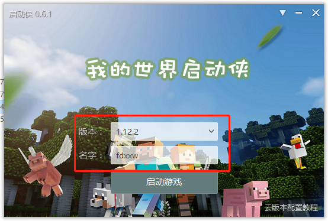

### 2.4 游戏操作

#### 2.4.1 单人游戏：

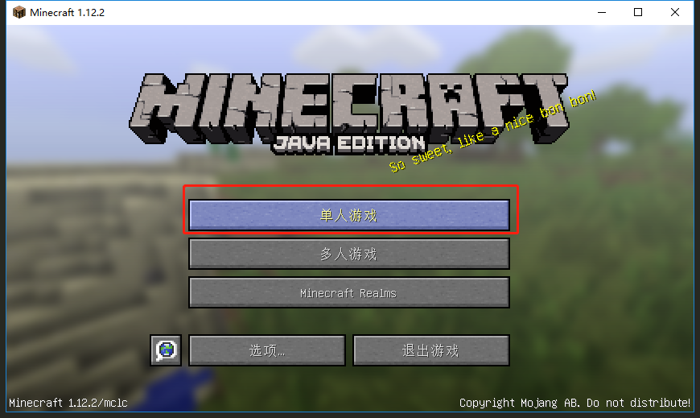

+ 创建世界

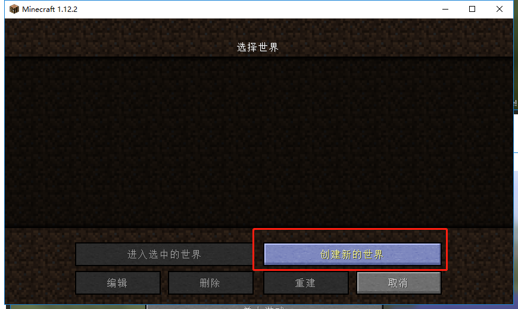

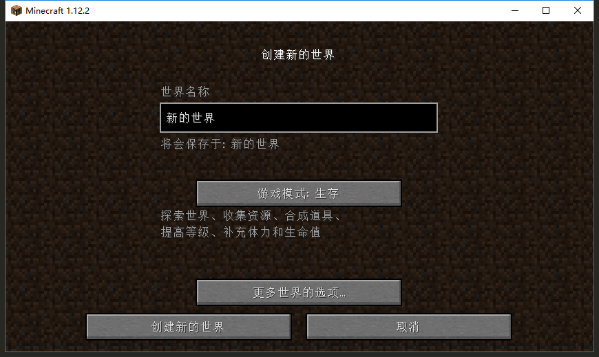

#### 2.4.2 多人游戏

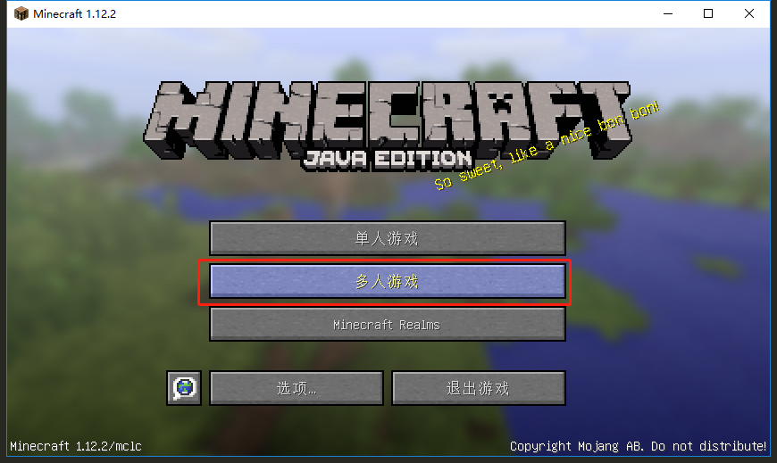

+ 添加服务器

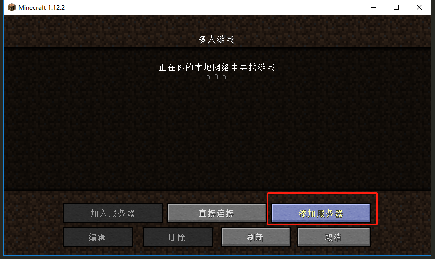

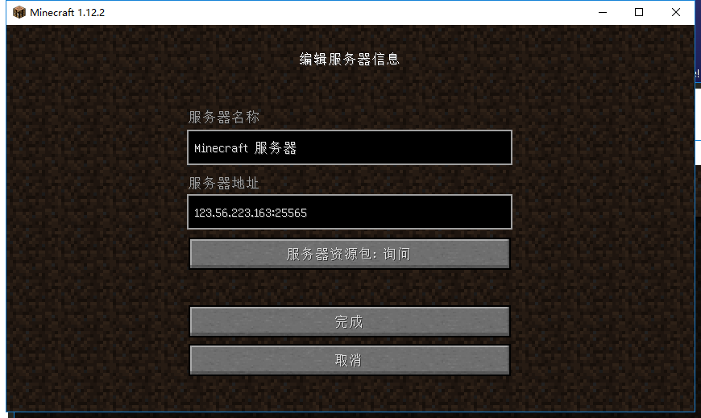

服务器地址：
>123.56.223.163:25565

#### 2.4.3 基本操作

+ 操作都要在英文输入下

+ F11可以全屏游戏

+ w,s,a,d 键控制人物前后左右走动

+ 空格键控制人物跳跃，一直按可以浮在水面，爬楼梯等

+ 鼠标左键破环，一直按可以破环方块， 不如把木头撸下来，还可以打怪物

+ 鼠标右键放置和使用东西， 比如撸下来的木头可以放置在地上

+ 鼠标滚轮可以循环选中背包栏里的东西，选中哪个就可以使用哪个

+ 其它的可以自己探索

